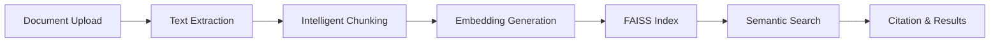

# 📚 DocuSearch

Find answers across PDF, Word, Text, and PowerPoint (.pptx) files in seconds using natural-language search.
This app extracts and indexes document content locally, then returns the most relevant passages with page-level citations.
Export results to CSV or JSON for quick sharing, reporting, or follow-up analysis.


## 🌟 Key Features

### Core Capabilities
- **📄 Document Upload**: Upload and process PDF, Word, Text, and PowerPoint (.pptx) documents with intelligent chunking
- **🔍 Semantic Search**: Embedding-based retrieval using SentenceTransformers
- **🖼️ OCR Support**: Extract text from matching images inside supported documents
- **🗳️ Citation System**: Complete source attribution with page-level citations
- **📥 Export Results**: Download search results as CSV or JSON
- **⚡ FAISS Integration**: Blazing-fast similarity search with optimized vector indices
- **💻 Local Processing**: Search and indexing run on your machine

### Technical Excellence
- **Production-Ready Architecture**: Clean separation of concerns, modular design
- **Type-Safe**: Full type hints throughout the codebase
- **Error Handling**: Comprehensive exception handling and logging
- **Caching**: Intelligent caching for optimal performance
- **Scalable**: Designed to handle large document collections
- **Configurable**: Environment-based configuration system
- **No Hidden Costs**: Everything runs locally without external API dependencies

## 🏗️ Architecture

```
docusearch/
│
├── app.py                         # Streamlit launcher entrypoint
├── src/
│   ├── config/
│   │   └── config_manager.py      # Loads .env once and exposes typed config
│   ├── interfaces/
│   │   └── streamlit_app.py       # Streamlit UI orchestration and app flow
│   ├── pipeline/
│   │   └── document_pipeline.py   # Document processing orchestration
│   ├── retrieval/
│   │   └── rag_pipeline.py        # Core retrieval engine
│   └── utils/
│       ├── css.py                 # Custom Streamlit styling
│       ├── exceptions.py          # Domain-specific exception classes
│       ├── runtime_env.py         # Runtime env bootstrap for tokenizer/CPU threads
│       └── ui.py                  # Search result rendering and export
│
├── resources/                     # Static/supporting assets
├── docs/                          # Project documentation
├── notebooks/                     # Analysis notebooks
├── output/
│   ├── logs/                      # Application logs
│   └── plots/                     # Generated visual outputs
│
├── data/
│   └── pdfs/                      # Document storage
│
├── requirements.txt               # Dependencies
├── .env.example                   # Environment template
└── venv/                          # Virtual environment
```

### System Flow



## Known Limitations

- Legacy PowerPoint `.ppt` files are not supported. Convert to `.pptx` before upload.

## 🚀 Quick Start

### Prerequisites

- Python 3.8 or higher
- pip package manager
- Virtual environment (recommended)

### Installation

1. **Clone or navigate to the project directory**
   ```bash
   cd DocuSearch
   ```

2. **Activate your virtual environment**
   ```bash
   # Windows
   venv\Scripts\Activate.ps1
   
   # Linux/Mac
   source venv/bin/activate
   ```

3. **Install dependencies**
   ```bash
   pip install -r requirements.txt
   ```

4. **Run the app**
   ```bash
   streamlit run app.py
   ```

   If your Streamlit launcher script has a stale interpreter path, use:
   ```bash
   venv/bin/python -m streamlit run app.py
   ```

5. **Configure environment (optional)**
   ```bash
   cp .env.example .env
   # Edit .env with your preferred settings
   ```

## ✅ Minimal Tests

Run the basic test suite:

```bash
pytest -q
```
